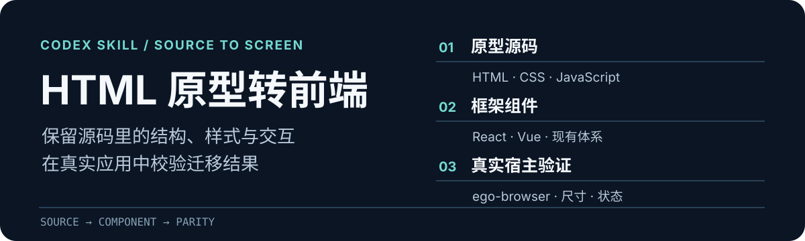

<p align="center">
  
</p>

# HTML 原型转前端页面

这是一个 Codex skill：把已有 HTML、CSS、JavaScript 原型迁移到 React、Vue 等前端框架或现有组件体系，并在目标应用中检查视觉、交互与数据结果。

**适合的任务：**原型已经有源码，目标项目也已经存在，需要尽量保留原型的页面结构和行为。它不会凭截图重新设计页面，也不会根据演示数据猜测后端接口。

## 从源码到真实页面

1. **读原型与目标项目。**确认原型的 DOM、CSS、脚本、资源和状态，以及目标项目的入口、宿主、组件和数据来源。
2. **迁移结构、样式与行为。**保留布局数值、资源、响应式规则和可观察交互；把手动 DOM 更新改为目标框架的状态机制。
3. **在真实入口校验。**使用 `ego-browser` 比较相同内容宽度、字体、数据和状态下的元素矩形、计算样式与页面效果；验证完关闭本次打开的标签页。不使用 Playwright。

原型源码提供精确的实现依据，浏览器负责找出迁移时产生的偏差。只有实际验证过的页面和状态才能声称一致。

## 开始使用

将仓库安装到 Codex 的全局 skills 目录：

```bash
git clone https://github.com/RockdaC239/html-prototype-to-frontend.git ~/.codex/skills/html-prototype-to-frontend
```

然后向 Codex 提供**原型路径、目标项目路径、真实访问入口和迁移范围**，例如：

> 用 `$html-prototype-to-frontend` 将 `prototype/admin.html` 迁移到现有 Vue 管理端。保留默认页、筛选和详情弹窗，最终在 Dashboard 宿主入口校验。

如果目标技能目录已经存在，更新现有安装即可；不要在同一路径重复克隆。

## 技能内容

| 文件 | 何时阅读 |
| --- | --- |
| [SKILL.md](SKILL.md) | 每次迁移都要用的框架无关流程 |
| [对齐与验收参考](references/parity.md) | 比较视觉、状态、数据语义和宿主集成时 |
| [React 迁移参考](references/react.md) | 目标项目使用 React 时 |

## 使用边界

- 后端接口未确定时，按目标项目规则保留明确的本地演示状态，不编造接口或将演示台账当作正式数据。
- 独立预览、构建通过或单张截图都不足以证明真实宿主中的像素级一致。验收应注明内容宽度、样例数据、时间、已覆盖状态与剩余差异。
- 这是框架无关的迁移流程；React 专项说明只在目标项目确实使用 React 时加载。
